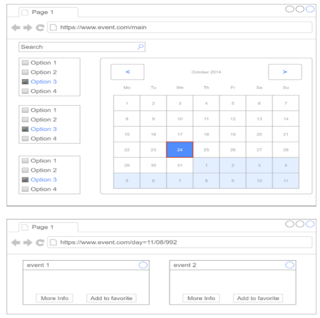
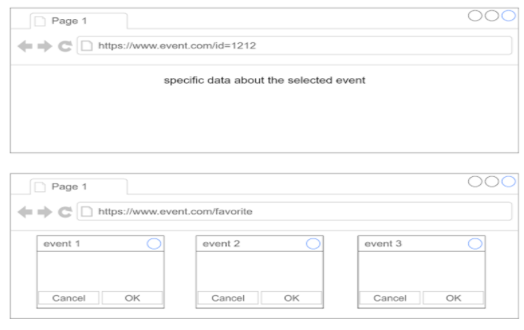

# Planning and Scheduling

# Apis that I'm going to use
* Eventbrite - Find events
* Picatic - Sell tickets anywhere
* Ticketmaster - Search events, attractions, or venues
* Bandsintown - Music Events
* Songkick - Music Events
* Foursquare - Interact with Foursquare users and places (geolocation-based check-ins, photos, tips, events, etc) 

* Optional
    * Google Calendar - Display, create and modify Google calendar events
    * Hebrew Calendar - Convert between Gregorian and Hebrew, fetch Shabbat and Holiday times, etc

# Schema
;
;
