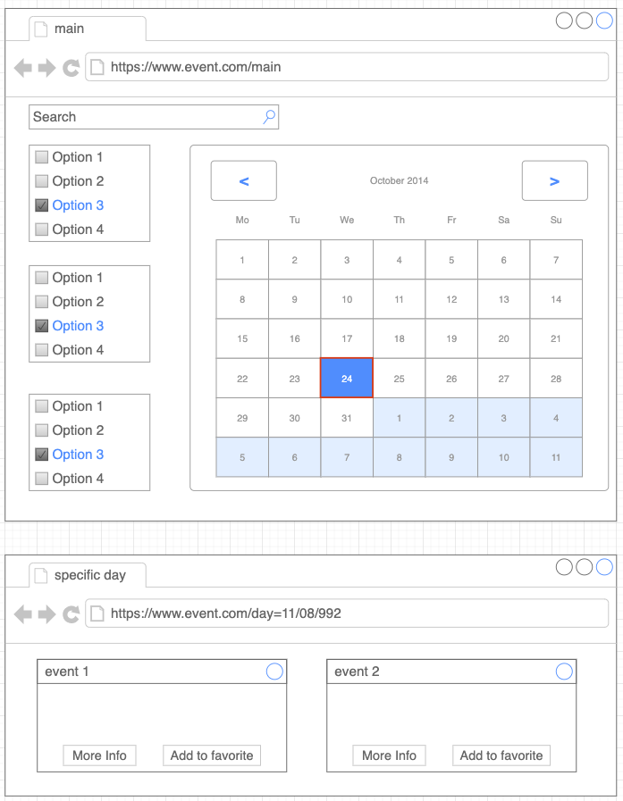
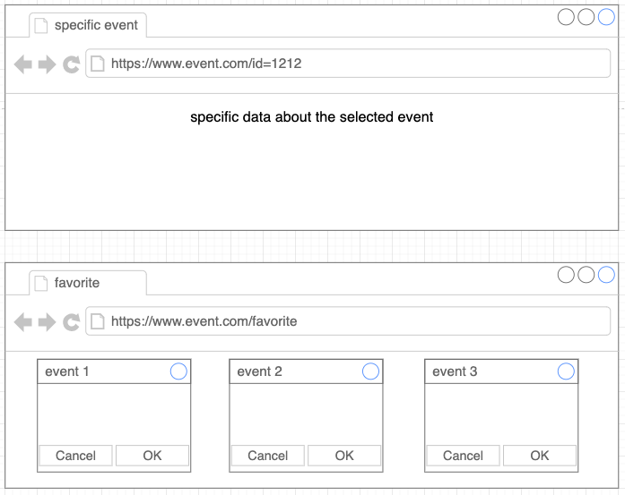

# Planning and Scheduling

# General information about my site
* Netlify Link: [Mine-Events](https://mine-events.netlify.app "Mine-Events")
* Technology Wise:
    * React.js
    * Redux.js (redux-thunk, actions, reducers, store)
    * React-Ruter
    * Moment
    * Purely functional components ( useState, useEffect, useDispatch, useSelector, etc..)
    * Material-UI
    * CURD opertions with Local Storage
    * Axios && web API's

# Apis that I'm going to use
* Eventbrite - Find events
* Picatic - Sell tickets anywhere
* Ticketmaster - Search events, attractions, or venues
* Bandsintown - Music Events
* Songkick - Music Events
* Foursquare - Interact with Foursquare users and places (geolocation-based check-ins, photos, tips, events, etc) 

* Optional
    * Google Calendar - Display, create and modify Google calendar events
    * Hebrew Calendar - Convert between Gregorian and Hebrew, fetch Shabbat and Holiday times, etc

# Application Functionality
* All events will be displayed in the calendar on the main page, clicking on any event will take the user to a new page where all the details will appear.
* Moving back and forth in the timeline.
* Add events to your user list, using a local storge.
* A variety of filtering options. 
* A search option.
* Add an event to Google Calendar.
* Using the user's geographic location.

# Schema
;
